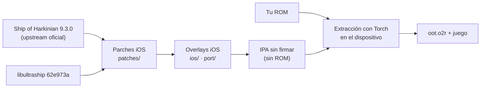

# HarkinianPad · fork de mtbolanos

<p align="center">
  <strong>Ocarina of Time vía Ship of Harkinian 9.3.0, nativo en iPhone y iPad.</strong><br>
  Fork de <a href="https://github.com/chrissotraidis/harkinianpad">HarkinianPad</a> de chrissotraidis,
  actualizado a la última versión de upstream, con red (Anchor) y ProMotion de verdad.
</p>

<p align="center">
  <a href="https://github.com/Mtbolanos/harkinianpad/actions/workflows/ios-build.yml"></a>
  
  
  
  
  
</p>


## Por qué existe este fork

HarkinianPad es un trabajo excelente de [chrissotraidis](https://github.com/chrissotraidis):
lleva [Ship of Harkinian](https://github.com/HarbourMasters/Shipwright) a iOS con
render en Metal y controles táctiles personalizables. Hice este fork porque quería:

- **Jugar la última versión de Ship of Harkinian.** El original venía de una
  rama `develop` anterior a 9.3.0 "Dewey".
- **Recuperar el multijugador.** El original deshabilitaba el menú **Network**
  (Anchor, Sail y Crowd Control) porque no había SDL2_net para iOS.
- **Que ProMotion funcione bien.** Subir los FPS sobre 60 provocaba caídas bajo
  20 FPS en iPhone.
- **Aprovechar la resolución real de la pantalla.** El juego y los menús se
  dibujaban a un tercio de la resolución del panel.

## Qué cambia respecto del original

| | HarkinianPad 0.2.1 (original) | Este fork 0.3.0 |
|---|---|---|
| Upstream | `develop` (9.2.3 + 301 commits) | **Ship of Harkinian 9.3.0 "Dewey"** |
| Fuentes | Forks propios de Shipwright y libultraship | Upstream oficial fijado por commit + parches revisables en [`patches/`](patches/) |
| Extracción de la ROM | ZAPD/OTRExporter | **Torch**, el extractor oficial de 9.3.0 |
| Menú Network | Deshabilitado | **Anchor, Sail y Crowd Control** (SDL2_net 2.4.0 estático) |
| FPS / ProMotion | Interpolaba a 120 pero iOS presentaba a 60 | Interpola a la tasa real de la pantalla: 120 Hz con ProMotion, 60 Hz en modo de bajo consumo |
| Resolución | Juego y menús a 1/3 del panel | Menús siempre nítidos. Opción **Native Screen Resolution** para el juego |
| Tope de FPS | — | **Lock at 60 FPS**, opcional, para jugar a resolución nativa con 60 estables |
| Menús táctiles | Sin scroll con el dedo | Scroll con un dedo e inercia, sin mover sliders por accidente. Tooltips con el dedo quieto |
| Metal | — | Caché de estados de depth-stencil |
| Bundle ID | `com.chrissotraidis.harkinianpad` | `cl.mtbolanoss.harkinianpad` |

### Opciones nuevas en el menú

En **Settings → Graphics**:

- **Native Screen Resolution** (apagada por defecto). Dibuja el juego a la
  resolución física de la pantalla. Se ve mucho más nítido, pero exige bastante
  más a la GPU, la batería y la temperatura.
- **Lock at 60 FPS**, justo debajo. Solo actúa con la resolución nativa
  encendida: fija la interpolación en 60 y bloquea el slider de FPS, que
  conserva tu valor. Si apagas la resolución nativa, la opción queda en pausa con
  su marca y vuelve a aplicarse al encenderla.

En **Settings → Network**: Anchor, Sail y Crowd Control, igual que en escritorio.
Anchor usa `anchor.hm64.org` por defecto. Sail y Crowd Control apuntan a
`127.0.0.1`, así que en el iPhone hay que poner la IP del equipo que corre el
servicio.

### Scroll táctil en los menús

- Arrastrar hace scroll, con inercia, y nunca presiona botones ni mueve sliders.
- Solo un arrastre claramente horizontal mueve un slider.
- Con el dedo quieto se muestra el tooltip sin presionar nada. Un toque se
  aplica al soltar.
- Las barras de scroll se agarran y arrastran como en un navegador.
- Los controles táctiles del juego no pasan por este filtro.

<a id="get-started"></a>
## Cómo compilarlo

Este repositorio no publica apps compiladas. Cada quien
compila la suya desde el código de Ship of Harkinian (ver
[derechos y licencias](#derechos-y-licencias)).

Necesitas un Mac con Xcode, [Homebrew](https://brew.sh) y CMake
(`brew install cmake`), además de Python 3.9 o superior.

```sh
git clone https://github.com/Mtbolanos/harkinianpad.git
cd harkinianpad

# IPA sin firmar para iPhone/iPad
scripts/build-ios.sh --device
scripts/package-ios.sh
```

El script descarga los commits exactos de upstream ([`sources.lock.json`](sources.lock.json)),
aplica y verifica los parches, genera el `soh.o2r` sin ROM con el empaquetador
oficial y compila. El resultado es
`artifacts/HarkinianPad-0.3.0-preview.10-unsigned.ipa`. Fírmalo con tu
herramienta de sideloading de siempre.

El código actual compila para arm64 con iOS/iPadOS 15 o superior.

Cada push también compila en GitHub Actions. Para firmar con tu propio equipo de
desarrollo, para el simulador y para el detalle completo, ver
[`docs/BUILDING.md`](docs/BUILDING.md) (en inglés).

> [!NOTE]
> **¿Vienes del HarkinianPad original?** Este fork usa otro bundle ID, así que se
> instala como una app aparte. Para llevarte tus partidas, copia `Save/`,
> `shipofharkinian.json` y tus mods desde la carpeta del original. **No copies
> `oot.o2r`**: Torch lo vuelve a generar desde tu ROM.

<a id="first-launch"></a>
## Primer arranque

1. Abre la app una vez para que iOS cree su carpeta.
2. En **Archivos → En mi iPhone → HarkinianPad**, copia tu ROM de Ocarina of Time.
3. Vuelve a la app y toca **Rescan**. Déjala abierta mientras genera `oot.o2r`.
4. Presiona Start.

La ROM y el archivo generado nunca salen de la app.

## Controles

Los controles táctiles son los del original: stick, D-pad, A/B/Z, botones C,
L/R y Start, con un editor para mover, cambiar de tamaño u ocultar cada uno, y
opacidad ajustable. Desde **Settings → Controls** puedes ocultarlos cuando usas
un control físico. También hay soporte para teclado, mouse/trackpad y controles
compatibles con SDL2.

## Cómo está armado



| Ruta | Para qué sirve |
|---|---|
| [`patches/shipwright-ios.patch`](patches/) | Integración iOS sobre Ship of Harkinian |
| [`patches/libultraship-ios.patch`](patches/) | libultraship para iOS, compartida con [MaskPad](https://github.com/Mtbolanos/maskpad) |
| [`ios/`](ios/), [`port/`](port/) | Código iOS (controles táctiles, ciclo de vida) y CMake |
| [`scripts/`](scripts/) | Clonar, parchar, verificar, compilar y empaquetar |

## Créditos

- **[chrissotraidis](https://github.com/chrissotraidis)**, autor de HarkinianPad:
  la integración iOS, los controles táctiles y todo lo que hace posible este fork.
- **[Harbour Masters](https://github.com/HarbourMasters)**, por Ship of Harkinian,
  libultraship y Torch.
- El proyecto de decompilación de Ocarina of Time, SDL, SDL2_net y sus contribuidores.

<a id="derechos-y-licencias"></a>
## Derechos y licencias

Proyecto comunitario no oficial, sin relación con Nintendo ni con Harbour Masters.
No incluye el juego, ROMs ni datos derivados de una ROM: necesitas tu propia
copia legal.

El código propio de HarkinianPad pertenece a chrissotraidis y no tiene una
licencia libre. Lee [`RIGHTS_AND_LICENSES.md`](RIGHTS_AND_LICENSES.md) (en
inglés) antes de copiar o distribuir. Cada componente de terceros conserva su
propia licencia.
